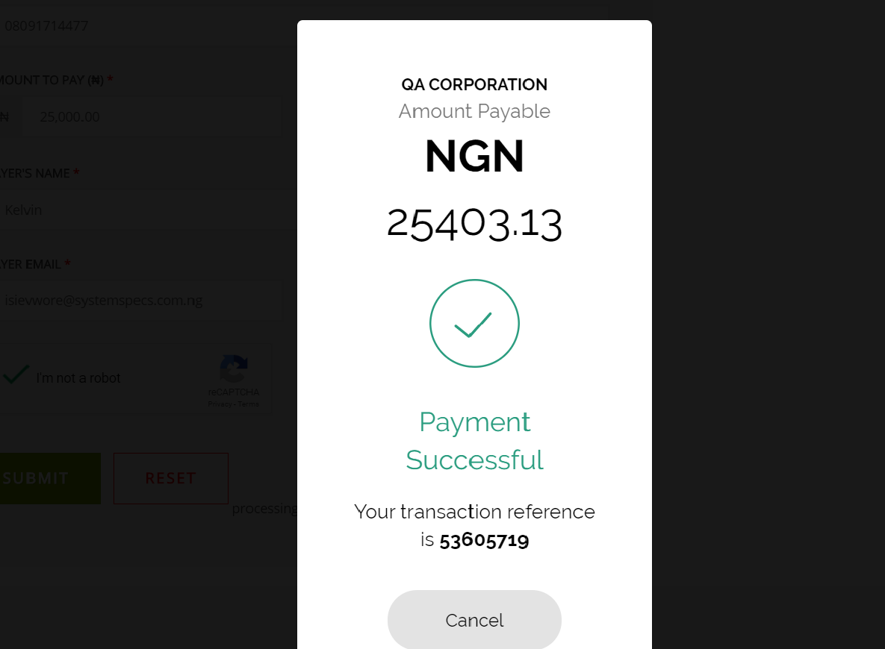

# Remita Payment Gateway Plugin For Ecwid
### How to setup Remita Payment Gateway on Ecwid Platform

---
- [Summary](#summary)
- [Plugin Features](#Plugin Features)
- [Installation instructions](#Installation instructions)
---
### Summary

With Remita Ecwid Payment Plugin, the store admin can easily add all desired payment methods to the Ecwid webshop. Please refer to https://www.remita.net for an overview of all features and services.

### Plugin Features

*   __Accept payment__ via Visa Cards, Mastercards, Verve Cards, USSDs, Mobile Money and eWallets.

* 	__Seamless integration__ into the Ecwid checkout page.

* 	__Secure payments__ with PCI-Compliance with fraud protection.

* 	__Automatic payouts__ to your bank account the next day.

---

### Installation instructions

Ecwid makes it possible for small business owners and merchants to easily set up an online store on any website, social site, and most eCommerce platforms.

The instructions below shows you how to accept payments on your Ecwid site with Remita.

1. Kindly log on to https://www.ecwid.com/ if you have an existing account or sign up for a new account.

2. Please click on the __Payment__ tab on the left side of your account’s dashboard, and scroll down to the __Others ways to get paid__ section. Here you will be required to click on the __Choose Payment Processor__ button.

3. Choose __Remita Payment Gateway__.

4. Please wait while the Merchant page loads.

5. Here you will be required to set-up the Remita environment you wish to have on your Ecwid account. To achieve this;
    
    a.) Click on the toggle button on the right side to toggle between the Staging (test) and the Live environment.
    
    b.) Next, click on the __Get API Keys__ button to get your Public/Secret keys for Staging(test) environment or the Live environment as determined in (a) above.
    
    c.) You will be redirected to your Remita account where you will get your Public/Secret Keys, kindly input same into the respective field.
    
    Hurray! You are done configuring your Ecwid site. You can now close this page by clicking on the __X__ button on the top right side.

6. Now Visit your site’s store and click on the item you wish to purchase.

7. Next, click on the __Add to Bag__ button.

8. Input your email address and click on __Checkout__.

9. Select __Remita Payment Gateway__ as your payment method and input the other required details as shown.

10. Input your card details and click on pay.

Thank you for setting up Remita Payment Gateway on Ecwid following this simple steps.
